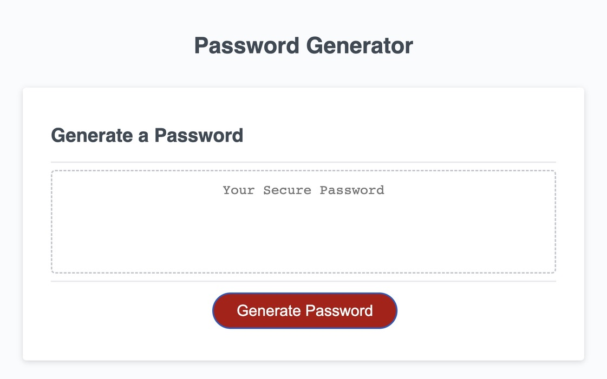

# password-generator

## Technology Used 

| Technology Used         | Resource URL           | 
| ------------- |:-------------:| 
| HTML    | [https://developer.mozilla.org/en-US/docs/Web/HTML](https://developer.mozilla.org/en-US/docs/Web/HTML) | 
| CSS     | [https://developer.mozilla.org/en-US/docs/Web/CSS](https://developer.mozilla.org/en-US/docs/Web/CSS)      |   
| Git | [https://git-scm.com/](https://git-scm.com/)     | 
| Javascript | [https://developer.mozilla.org/en-US/docs/Web/JavaScript] (https://developer.mozilla.org/en-US/docs/Web/JavaScript)   |

## Description 

[Visit the Deployed Site](https://youtu.be/BFyeuLhjcPY)

My site has the ability to generate a user a random password that includes optional variables for the password inteded for those looking to create an account, but can't think of an unpredictable password. Depending on the criteria the user has, items like upper and lower case letters can be chosen to be included in the password. The password is then displayed on the page for the user for copy and paste. The site was created using HTML and CSS started code and added functions accodingly from Javascript.


## Table of Contents (Optional)

If your README is very long, add a table of contents to make it easy for users to find what they need.

* [Javascript Example](#javascript-example)
* [Usage](#usage)
* [Learning Points](#learning-points)
* [Author Info](#author-info)
* [Credits](#credits)


## Javascript Example

To get a hold of this project, simply navigate to my Github profile and select the repo "password-generator". From there copy the SSH link into your terminal, Gitbash, or whatever application you prefer and use git copy and then paste link. You can then open it using VS Code.


```javascript
   var lowercase = "abcdefghijklmnopqrstuvwxyz";
   var uppercase = "ABCDEFGHIJKLMNOPQRSTUVWXYZ";
   var numeric = "0123456789";
   var special = "!#$%&()*+,-./;:<>=?@[/]^";
```

In the above code, I used arrays to store the different characters within the variables users can choose from. [<header> Array](https://developer.mozilla.org/en-US/docs/Web/JavaScript/Reference/Global_Objects/Array). 

```javascript
if (lengthPass < 8 || lengthPass > 128) {
     alert("password must contain at least 8 characters and less than 129 characters");
     return lengthChar;
   }
  
   var userLowercase = confirm("include lowercase characters?")
   if (userLowercase) {passwordChar += lowercase}

  var userUppercase = confirm("include uppercase characters?")
   if (userUppercase) {passwordChar += uppercase}

  var userNumeric = confirm("include numeric characters?")
   if (userNumeric) {passwordChar += numeric}

   var userSpecial = confirm("include special characters?")
   if (userSpecial) {passwordChar += special}

   for (var i = 0; i < lengthPass; i++) {
     password += passwordChar[Math.floor(Math.random() * passwordChar.length)];
   }

```

I then used if statements that would ask the user to confirm if they wanted to add a certain variable. The for loop along would then combine the chosen variables to create the random password.


## Usage 

In order to use the password generator, open it using the deployed link. From there click the "generate password" button. It will then ask how long you want the password to be, but it must be between 8 to 128 charcters. After it will ask to confirm whether or not you want lowercase, uppercase, numeric, or special characters. From there it will generate the password and display it for the user to copy.





## Learning Points 


Through this project I was able to learn and understand a lot more about Javascript. The main learning point was getting a better understanding of if statements and for loops and how to properly impliment them and getting them to do what I want. My understanding of properly placing certain elements in the right place has improved as well as I ran into bugs simply because I placed variable in the wrong area.


## Author Info


### Sam Higa 


* [Portfolio](https://samhiga.github.io/my-portfolio/)
* [LinkedIn](https://www.linkedin.com/in/sam-higa-b887b9209/)
* [Github](https://github.com/samhiga)


## Credits


